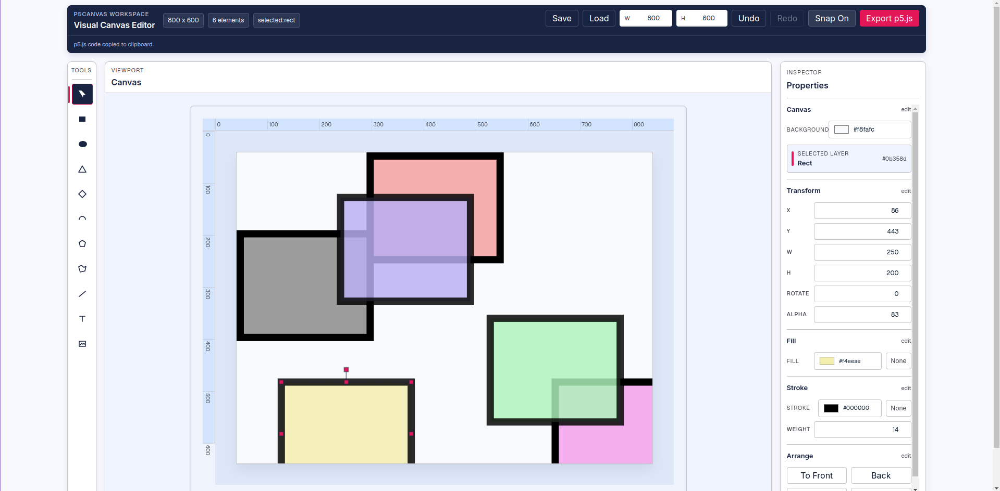
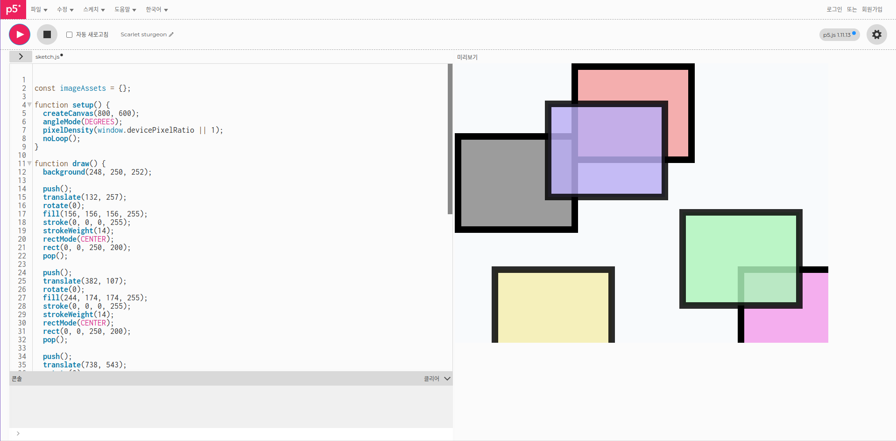

# draw-p5js
<div style="display: flex; gap: 20px; flex-wrap: wrap; justify-content: center; margin-bottom: 20px;">
  
  
</div>

draw-p5js는 p5.js 스타일의 장면을 시각적으로 만들고 코드로 내보낼 수 있는 캔버스 에디터입니다.  
p5.js를 배우는 교양 과목을 듣던 중, 과제를 할 때 그림 그리기가 너무 불편해서 만들었답니다.  
그리기만 하세요. 코드는 쓰지 않아도 됩니다.  

React, TypeScript, Vite, Zustand로 만들어졌습니다.

## 주요 기능

- 도형 도구: Select, Rect, Ellipse, Triangle, Diamond, Arc, Polygon, Free Polygon, Line, Text, Image
- 캔버스 편집: 드래그, 리사이즈, 회전, 다중 선택, 정렬/간격 맞춤
- 다중 선택 레이어 일괄 편집: X/Y/Rotate, Alpha, Fill, Stroke
- 상태 제어: Undo/Redo, JSON 저장/불러오기
- 30초마다 localStorage 자동 저장
- 내보내기: p5.js 코드 복사/다운로드, p5.js Web Editor로 열기

실제 sketch.js 출력물에서 각 요소의 위치는 캔버스와 다소 다를 수 있습니다.

## 빠른 시작

### 요구 사항

- Node.js 20+
- npm

### 설치 및 실행

```bash
npm install
npm run dev
```

Vite가 출력한 로컬 URL을 브라우저에서 열면 됩니다.

## 스크립트

```bash
npm run dev      # 개발 서버 실행
npm run build    # 프로덕션 빌드
npm run preview  # 빌드 결과 미리보기
npm run lint     # ESLint 실행
npm run test     # Vitest 실행
```

## JSON 가져오기 검증

JSON 가져오기와 localStorage 복원 모두 런타임 스키마 검증을 적용합니다.

- 검증 유틸리티: src/utils/canvasValidation.ts
- 실패 시 동작:
  - 가져오기: 사용자에게 상태 메시지 표시
  - 복원: 콘솔 경고 출력 후 복원 건너뜀

## Canvas JSON 스키마

앱은 CanvasState 형태의 JSON 문서를 기대합니다.

최상위 필수 필드:

- width: number
- height: number
- background: string
- elements: array

각 요소의 필수 필드:

- id: string
- type: rect, ellipse, triangle, diamond, arc, polygon, freePolygon, line, text, image 중 하나
- x, y, width, height, rotation: number
- style: object

style 필수 필드:

- fill: string
- stroke: string
- strokeWeight: number
- opacity: 0 이상 1 이하의 number

요소 선택 필드:

- text: string
- fontSize: number
- fontFamily: string
- src: string
- x2, y2: number
- arcStart, arcStop: number
- polygonSides: number
- polygonPoints: 점 배열 ({ x: number, y: number })

polygonPoints 참고:

- freePolygon 요소에서 사용됩니다.
- freePolygon 검증에는 최소 3개의 점이 필요합니다.
- 점 좌표는 요소 경계 기준 정규화 값이며 (0~1 범위 권장) 사용됩니다.

### 유효한 JSON 예시

```json
{
  "width": 800,
  "height": 600,
  "background": "#ffffff",
  "elements": [
    {
      "id": "el-1",
      "type": "rect",
      "x": 100,
      "y": 120,
      "width": 240,
      "height": 140,
      "rotation": 0,
      "style": {
        "fill": "#4A90D9",
        "stroke": "none",
        "strokeWeight": 0,
        "opacity": 1
      }
    }
  ]
}
```

### 유효한 Free Polygon JSON 예시

```json
{
  "width": 800,
  "height": 600,
  "background": "#ffffff",
  "elements": [
    {
      "id": "el-free-1",
      "type": "freePolygon",
      "x": 120,
      "y": 140,
      "width": 260,
      "height": 220,
      "rotation": 0,
      "polygonPoints": [
        { "x": 0.08, "y": 0.18 },
        { "x": 0.78, "y": 0.05 },
        { "x": 0.95, "y": 0.52 },
        { "x": 0.62, "y": 0.9 },
        { "x": 0.14, "y": 0.76 }
      ],
      "style": {
        "fill": "#4A90D9",
        "stroke": "#1E3A5F",
        "strokeWeight": 1,
        "opacity": 1
      }
    }
  ]
}
```

### 유효하지 않은 JSON 예시

opacity 범위를 벗어나 유효하지 않은 경우:

```json
{
  "width": 800,
  "height": 600,
  "background": "#ffffff",
  "elements": [
    {
      "id": "el-1",
      "type": "rect",
      "x": 100,
      "y": 120,
      "width": 240,
      "height": 140,
      "rotation": 0,
      "style": {
        "fill": "#4A90D9",
        "stroke": "none",
        "strokeWeight": 0,
        "opacity": 2
      }
    }
  ]
}
```

지원하지 않는 type이라 유효하지 않은 경우:

```json
{
  "width": 800,
  "height": 600,
  "background": "#ffffff",
  "elements": [
    {
      "id": "el-2",
      "type": "star",
      "x": 80,
      "y": 90,
      "width": 100,
      "height": 100,
      "rotation": 0,
      "style": {
        "fill": "#ffaa00",
        "stroke": "#000000",
        "strokeWeight": 1,
        "opacity": 1
      }
    }
  ]
}
```

## 테스트

검증 테스트는 test 폴더 아래에 분리되어 있습니다.

- 테스트 파일: test/canvasValidation.test.ts
- 이 스위트의 커버리지: 유효 케이스 11개, 유효하지 않은 케이스 11개

실행:

```bash
npm run test
```
